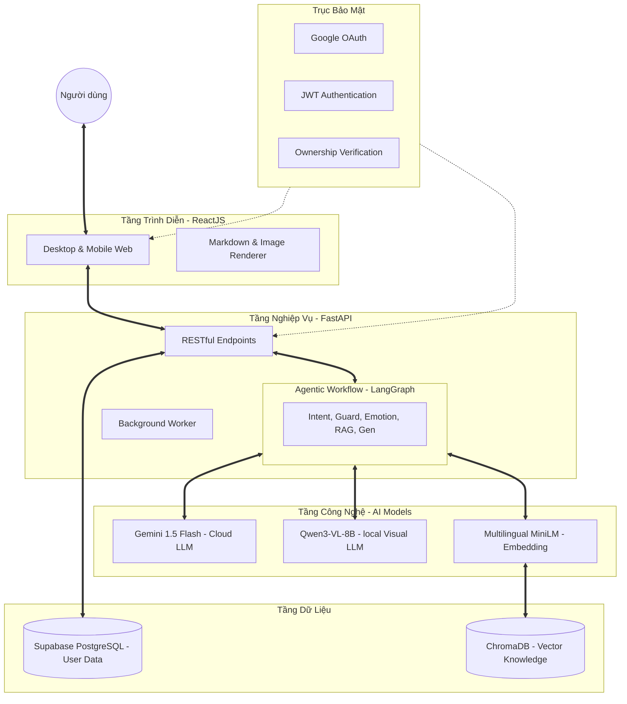
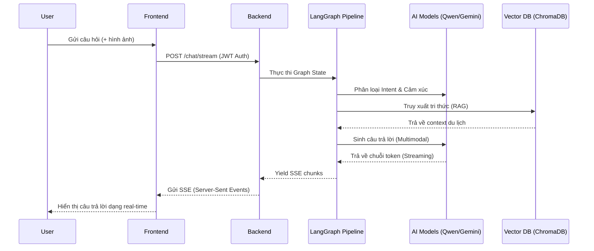

# BÁO CÁO HỆ THỐNG VIVI TOURISM CHATBOT

## 3.1 Kiến trúc tổng thể hệ thống

### 3.1.1 Tổng quan hệ thống

Hệ thống **ViVi Tourism Chatbot** là một trợ lý du lịch thông minh đa phương thức, được thiết kế để cung cấp thông tin du lịch chính xác, cá nhân hóa và hỗ trợ phân tích hình ảnh. Chi tiết các thành phần chính:

* **Frontend:** Giao diện người dùng hiện đại, phản hồi nhanh, hỗ trợ streaming response.
* **Backend:** Hệ thống API hiệu năng cao tích hợp luồng xử lý Agentic.
* **AI Models:** Sự kết hợp giữa các mô hình ngôn ngữ lớn (LLM) hàng đầu (Gemini) và các mô hình local tối ưu (Qwen3-VL) cho các tác vụ chuyên biệt.
* **Database và hạ tầng:** Lưu trữ dữ liệu quan hệ, dữ liệu vector và triển khai trên hạ tầng hybrid (Local GPU + Cloud Services).

### 3.1.2 Kiến trúc hệ thống

Hệ thống được xây dựng trên kiến trúc phân lớp chuyên biệt:

* **Presentation Layer:** Sử dụng React 18, Ant Design v5 cho UI chuyên nghiệp.
* **Business Layer:** FastAPI đóng vai trò điều phối. Trái tim là LangGraph Pipeline quản lý luồng suy nghĩ của Agent.
* **Data Layer:** Dữ liệu nghiệp vụ (hội thoại, profile) trong PostgreSQL; Tri thức du lịch (VQA) trong ChromaDB.
* **Security Vertical:** Đảm bảo an toàn qua Google OAuth và cơ chế xác thực JWT cho từng request.

### 3.1.3 Luồng xử lý yêu cầu người dùng

Mô tả chi tiết luồng dữ liệu từ khi User gửi tin nhắn đến khi nhận được phản hồi:

---

## 3.2 Thiết kế hệ thống Agentic Workflow

### 3.2.1 Tổng quan LangGraph pipeline

Hệ thống sử dụng LangGraph để xây dựng một **Stateful Multi-Agent System**. Thay vì một prompt dài duy nhất, câu hỏi được chia nhỏ và xử lý qua các Node chuyên biệt, giúp tăng độ chính xác và khả năng kiểm soát.

### 3.2.2 Phân loại ý định người dùng (`intent.py`)

Sử dụng mô hình phân loại để xác định mục đích của User (ví dụ: tìm địa điểm, lên lịch trình, hỏi về ẩm thực). Kết quả này quyết định các Node tiếp theo trong workflow.

### 3.2.3 Kiểm soát nội dung và an toàn (`guard.py`)

Lớp bảo vệ vòng ngoài, kiểm tra các vi phạm chính sách, nội dung nhạy cảm hoặc câu hỏi không liên quan đến du lịch để từ chối trả lời một cách lịch sự.

### 3.2.4 Phân tích cảm xúc người dùng (`emotion.py`)

Xác định trạng thái cảm xúc của User (hào hứng, bực bội, trung lập) để điều chỉnh tông giọng phản hồi (Tone of voice) phù hợp nhất.

### 3.2.5 Xây dựng hồ sơ người dùng (`profiler.py`)

Phân tích lịch sử hội thoại để cập nhật sở thích (ví dụ: thích biển hơn núi, thích ăn cay) vào user profile, phục vụ cá nhân hóa.

### 3.2.6 Viết lại truy vấn (`rewriter.py`)

Tối ưu hóa câu hỏi của User bằng cách bổ sung context từ lịch sử, giúp quá trình truy xuất tri thức (RAG) đạt hiệu quả cao nhất.

### 3.2.7 Trích xuất địa điểm (`location_extractor.py`)

Node này có 2 nhiệm vụ:

1. **Fast Extraction:** Trích xuất nhanh địa điểm hiện tại để lọc dữ liệu.
2. **Lazy Extraction:** Chạy ngầm để trích xuất sâu và gắn tag địa điểm vào cơ sở dữ liệu khi đạt ngưỡng tin nhắn nhất định.

### 3.2.8 Truy xuất tri thức (`retriever.py`)

Thực hiện tìm kiếm ngữ nghĩa trên **ChromaDB**. Đặc biệt hỗ trợ **Multi-collection routing** (tìm riêng trong 'hotels', 'food', 'places') dựa trên Intent.

### 3.2.9 Sinh câu trả lời (`generator.py`)

Kết hợp Context từ RAG, Thông tin từ Hình ảnh, User Profile và Intent để tạo ra câu trả lời cuối cùng. Hỗ trợ cả Gemini Flash (tốc độ cao) và Qwen3-VL (local vision encoder).

### 3.2.10 Đánh giá và tối ưu câu trả lời (`evaluator.py`)

Node hậu xử lý, kiểm tra xem câu trả lời có bị ảo giác (hallucination) không, độ dài đã phù hợp chưa trước khi lưu vào chat logs.

---

## 3.3 Xây dựng hệ thống Retrieval-Augmented Generation (RAG)

### 3.3.1 Chuẩn bị dữ liệu tri thức du lịch

Hệ thống sở hữu kho tri thức du lịch đồ sộ được cấu trúc hóa theo các nhóm:

* **Địa điểm:** Thông tin chi tiết các danh lam thắng cảnh.
* **Lưu trú:** Danh sách khách sạn, homestay, resort kèm đánh giá.
* **Ẩm thực:** Các món đặc sản, địa chỉ nhà hàng nổi tiếng.
* **Lịch trình:** Các mẫu tour du lịch gợi ý theo ngày.

### 3.3.2 Tiền xử lý dữ liệu

Dữ liệu từ tệp `vqa_dataset.jsonl` được xử lý qua các bước:

* **Cleaning:** Loại bỏ nhiễu và định dạng thừa.
* **Normalization:** Chuẩn hóa tên tỉnh thành và địa danh.
* **Categorization:** Tự động phân loại vào 5 bộ sưu tập (Collections) khác nhau.

### 3.3.3 Sinh vector embedding

Sử dụng model `paraphrase-multilingual-MiniLM-L12-v2`. Đây là mô hình mạnh mẽ hỗ trợ đa ngôn ngữ, đặc biệt là tiếng Việt, giúp chuyển đổi văn bản thành các vector 384 chiều.

### 3.3.4 Xây dựng vector database

Lưu trữ bằng **ChromaDB**.

* Cấu trúc đa Collection giúp tăng tốc độ truy tìm.
* Hỗ trợ `Hard Filtering` theo địa lý (Tỉnh/Thành phố).

### 3.3.5 Cơ chế truy xuất ngữ nghĩa

Sử dụng **Cosine Similarity Search** kết hợp với **Score Boosting** cho các tài liệu khớp chính xác địa danh mà người dùng đang nhắc tới.

---

## 3.4 Xây dựng hệ thống hỏi đáp đa phương thức (Multimodal VQA)

### 3.4.1 Xử lý câu hỏi văn bản

Sử dụng Gemini 1.5 Flash hoặc Qwen3-VL-8B-Instruct. Hệ thống linh hoạt chuyển đổi giữa Cloud LLM và Local LLM dựa trên cấu hình `--llama`.

### 3.4.2 Xử lý câu hỏi dựa trên hình ảnh

ViVi có khả năng "nhìn" và "hiểu" hình ảnh:

* Nhận diện các địa danh du lịch qua ảnh chụp.
* Phân tích menu nhà hàng, biển báo hoặc phong cảnh trong ảnh.

### 3.4.3 Cơ chế Hệ thống hỏi đáp trực quan

Cơ chế độc đáo kết hợp giữa **Visual Discovery** và **Knowledge Retrieval**:

1. Model nhận diện vùng ảnh.
2. Trích xuất từ khóa địa danh từ ảnh.
3. Dùng từ khóa đó truy vấn thêm thông tin từ RAG.
4. Tổng hợp thành câu trả lời vừa mô tả được ảnh, vừa có tri thức thực tế.

---

## 3.5 Cơ chế cá nhân hóa hệ thống

### 3.5.1 Lưu trữ thông tin người dùng

Sử dụng **Supabase (PostgreSQL)** để quản lý:

* **Chat History:** Lưu vết toàn bộ cuộc trò chuyện.
* **User Preferences:** Lưu các sở thích được hệ thống học từ người dùng.
* **Communication Style:** Ghi nhớ cách người dùng muốn được xưng hô hoặc phong cách trả lời yêu thích.

### 3.5.2 Xây dựng hồ sơ người dùng

Node `profiler` thực hiện phân tích định kỳ hoặc sau mỗi phiên chat để cập nhật `user_profiles` table, giúp chatbot ngày càng "hiểu" chủ nhân hơn.

### 3.5.3 Điều chỉnh câu trả lời theo người dùng

* **Style Matching:** Nếu người dùng thích ngắn gọn, bot sẽ trả lời súc tích.
* **Proactive Suggestions:** Gợi ý các địa điểm tương tự với những gì người dùng từng khen trong lịch sử.

---

## 3.6 Triển khai hệ thống

### 3.6.1 Frontend

* **Framework:** React 18, Vite.
* **UI Library:** Ant Design v5 + Tailwind CSS.
* **Features:** SSE Streaming, Image Upload, Markdown rendering (Katex, Code Highlight).

### 3.6.2 Backend

* **Framework:** FastAPI (Python 3.12).
* **Orchestration:** LangGraph + LangChain.
* **Async Processing:** Tận dụng `asyncio` cho các tác vụ non-blocking.

### 3.6.3 Cơ sở dữ liệu

* **Relational:** Supabase (Cloud Postgres).
* **Vector:** ChromaDB (Local persistent).

### 3.6.4 Triển khai và vận hành

* **Hạ tầng:** Server local trang bị GPU NVIDIA phục vụ inference Qwen3-VL.
* **Connectivity:** **Cloudflare Tunnel** giúp expose dịch vụ ra internet an toàn mà không cần mở port router.
* **Containerization:** Đóng gói bằng **Docker** cho Backend để đảm bảo tính nhất quán môi trường.

---

## 3.7 Kết chương

Hệ thống **ViVi Tourism Chatbot** đại diện cho một bước tiến trong việc ứng dụng Agentic Workflow vào ngành du lịch. Với sự kết hợp giữa RAG mạnh mẽ, khả năng Multimodal linh hoạt và kiến trúc bảo mật đa lớp, hệ thống sẵn sàng phục vụ người dùng với trải nghiệm cá nhân hóa và thông minh nhất.
