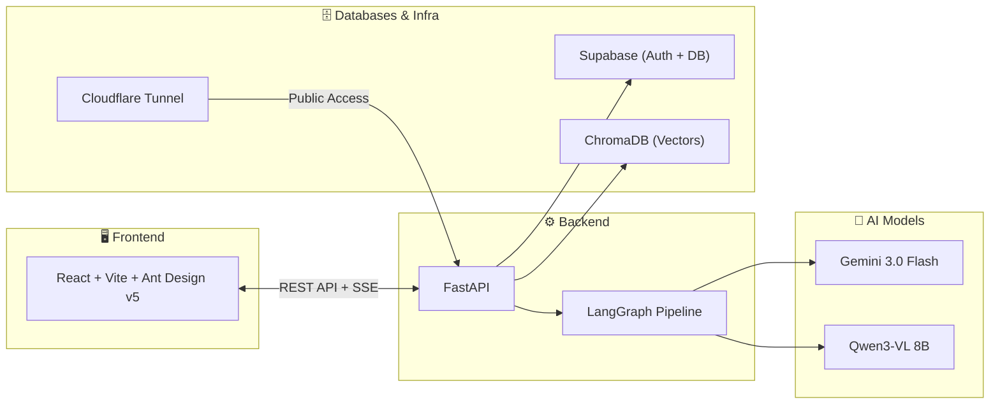
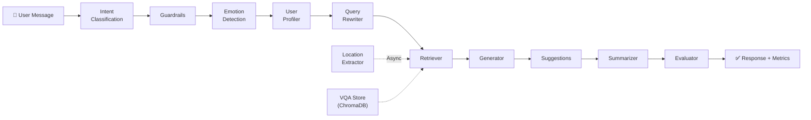

<p align="center">
  
</p>

<h1 align="center">ViVi — AI Travel Assistant for Vietnam 🇻🇳</h1>

<p align="center">
  <em>An intelligent, multi-modal travel companion powered by Agentic RAG, LLMs, and Computer Vision.</em>
</p>

<p align="center">
  
  
  
  
  
  
  
</p>

---

## 📸 Demo

<p align="center">
  
</p>

<p align="center"><em>Chat Page</em></p>

<details>
<summary><strong>🖼️ More Pages</strong></summary>

<br/>

| Landing Page | Features Page |
|:---:|:---:|
|  |  |

| Auth Page | Admin Page |
|:---:|:---:|
|  |  |

</details>

---

## 🌟 Project Overview

**ViVi** is a full-stack AI-powered travel assistant designed specifically for **Vietnam tourism**. It leverages advanced **RAG (Retrieval-Augmented Generation)** and **Agentic Workflows** (via LangGraph) to provide personalized, accurate, and culturally relevant travel advice — complete with visual understanding of travel images.

---

## ✨ Key Features

### 🤖 Intelligent Conversation
- **Multi-Model Support:** Seamlessly switches between **Gemini 3.0 Flash** (fast cloud response) and **Qwen3-VL 8B** (fine-tuned local visual model).
- **Agentic Workflow:** Powered by **LangGraph** with 12 specialized nodes — Intent Classification, Emotion Analysis, Guardrails, Query Rewriting, Retrieval, Generation, Evaluation, and more.
- **Context Awareness:** Maintains long-term memory of user preferences, travel style, and conversation history via Supabase.
- **Style Mimicry:** The AI analyzes recent user messages to adapt its tone (Casual vs. Professional/Formal).

### 🔍 Smart Retrieval (RAG)
- **Visual Question Answering (VQA):** Upload travel photos to get instant history, fun facts, or similar destination recommendations powered by **ChromaDB** vector search.
- **Real-time Suggestions:** Proactively suggests relevant travel topics and questions based on conversation context and user history.
- **Smart Location Extraction:** Automatically detects and normalizes Vietnamese location names (e.g., "Sài Gòn" → "Hồ Chí Minh", "Đà Lạt" → "Lâm Đồng") using a dual-engine (Regex + LLM) approach.

### ⚡ Performance & Optimization
- **~15s Latency Reduction:** Heavy AI tasks (deep location extraction, auto-titling) are moved to background async processes.
- **Fast Location Extraction:** Regex/Dictionary-based instant extraction provides immediate travel suggestions while the main response generates.
- **Async Image Verification:** Backend verifies image URL status (HEAD request) before sending to client, removing dead links automatically.
- **Robust JSON Parsing:** Enhanced `gemini_client` handles Markdown code blocks, trailing commas, and malformed JSON responses gracefully.

### 🖼️ Robust Image Handling
- **Strict No-Hallucination:** System prompt strictly forbids generating fake image URLs. Images are only shown if they exist in the retrieved context.
- **Smart Rendering:** Frontend automatically detects raw image URLs in text and converts them to rendered Markdown images.
- **Fallback UI:** Broken images are automatically hidden. `loading="lazy"` enabled for better performance.

### 🎨 Modern User Experience
- **Ant Design v5:** Premium UI system with custom theme tokens, dark/light mode, and responsive design across all pages.
- **ChatGPT-like Session Management:** Grouped sidebar (Today / Yesterday / Last 7 days), pinning, renaming, and lazy-loaded session history.
- **Emotion-Adaptive Theme:** The UI palette dynamically shifts based on detected user emotion (positive, curious, negative).
- **Multi-Language:** Full support for Vietnamese, English, and Chinese interface.

### 🛡️ Admin Dashboard
- **User Management:** Monitor activity, manage roles, and view user details.
- **Audit Logs:** Deep visibility into all system actions and API calls.
- **Live System Telemetry:** Real-time monitoring of AI model latency, GPU usage, and system health.
- **Analytics & Export:** View conversation stats, model performance metrics, and export data.

### 🚀 Deployment
- **Cloudflare Tunnel:** Secure public access to the local backend without exposing ports or requiring a static IP.
- **Docker Ready:** Containerized setup for reproducible deployment.
- **Supabase Cloud:** Managed PostgreSQL database with built-in Auth, Row-Level Security, and real-time subscriptions.

---

## 🛠️ Tech Stack

### Frontend
| Technology | Purpose |
|:---|:---|
| **React 18 + Vite** | Core framework with ultra-fast HMR |
| **TypeScript** | Type-safe development |
| **Ant Design v5** | Premium UI component library with custom theme |
| **@ant-design/icons** | Unified icon system |
| **React Router v6** | Client-side routing |
| **react-markdown** | Markdown rendering with GFM support |
| **Lucide React** | Supplementary icons for chatbot interface |

### Backend
| Technology | Purpose |
|:---|:---|
| **FastAPI** | High-performance Python API framework |
| **LangGraph + LangChain** | Agentic workflow orchestration (12 nodes) |
| **Gemini 3.0 Flash** | Cloud LLM for fast reasoning and JSON generation |
| **Qwen3-VL 8B** | Fine-tuned local model for visual Q&A |
| **ChromaDB** | Vector database for semantic search (RAG) |
| **Supabase** | Auth, PostgreSQL storage, and real-time features |

### Infrastructure
| Technology | Purpose |
|:---|:---|
| **Docker** | Containerized deployment |
| **Cloudflare Tunnel** | Secure public access to local services |
| **Git / GitHub** | Version control and collaboration |
| **Linux / Ubuntu** | Server environment |

---

## 🏗️ Architecture

### Diagram 1 — System Overview



### Diagram 2 — LangGraph Agent Workflow



---

## 🚀 Getting Started

### Prerequisites
- **Node.js 18+** & npm
- **Python 3.10+** (Conda recommended)
- **Supabase** Account & Project
- **Google Gemini API Key**

### 1. Clone the Repository
```bash
git clone https://github.com/Qhuy204/TourismChatbot.git
cd TourismChatbot
```

### 2. Frontend Setup
```bash
cd Frontend
npm install
npm run dev
```
The frontend will be available at `http://localhost:5173`.

### 3. Backend Setup
```bash
cd Backend
pip install -r requirements.txt
```

Create a `.env` file with the following variables:
```env
SUPABASE_URL=your_supabase_url
SUPABASE_KEY=your_supabase_anon_key
GEMINI_API_KEY=your_gemini_api_key
```

Start the API server:
```bash
uvicorn main:app --reload --port 8001
```

### 4. (Optional) Cloudflare Tunnel
```bash
./run_tunnel.sh
```
This exposes the backend securely via Cloudflare without opening ports.

---

## 📁 Project Structure

```
TourismChatbot/
├── Frontend/                    # React + Vite + Ant Design v5
│   ├── src/
│   │   ├── components/          # Reusable UI components
│   │   │   ├── chatbot/         # ChatbotInterface (main chat UI)
│   │   │   └── layout/          # Navbar, Footer
│   │   ├── pages/               # Route pages
│   │   │   ├── LandingPage.tsx
│   │   │   ├── AuthPage.tsx
│   │   │   ├── FeaturesPage.tsx
│   │   │   ├── admin/           # 8 admin dashboard pages
│   │   │   └── ...
│   │   ├── hooks/               # Custom React hooks
│   │   └── layouts/             # AdminLayout (AntD ConfigProvider)
│   └── public/
├── Backend/                     # FastAPI + LangGraph
│   ├── main.py                  # FastAPI app entry point
│   ├── langgraph_agent/
│   │   ├── graph.py             # LangGraph pipeline definition
│   │   ├── state.py             # State schema
│   │   ├── nodes/               # 12 specialized agent nodes
│   │   │   ├── intent.py        # Intent classification
│   │   │   ├── guard.py         # Safety guardrails
│   │   │   ├── emotion.py       # Emotion detection
│   │   │   ├── generator.py     # Response generation
│   │   │   ├── evaluator.py     # Hallucination scoring
│   │   │   └── ...
│   │   ├── retrieval/           # ChromaDB vector store
│   │   ├── memory/              # Session & preference storage
│   │   ├── utils/               # Gemini client, Qwen client
│   │   └── configs/             # YAML configurations
│   └── requirements.txt
├── docs/screenshots/            # Demo screenshots
└── README.md
```

---

## 🧠 LangGraph Pipeline — 12 Agent Nodes

| Node | Responsibility |
|:---|:---|
| `intent.py` | Classifies user intent (greeting, tourism query, general chat, etc.) |
| `guard.py` | Safety guardrails — blocks harmful or off-topic requests |
| `emotion.py` | Detects user emotion from message text (positive, negative, surprise, neutral) |
| `profiler.py` | Builds user preference profile from conversation history |
| `rewriter.py` | Rewrites vague queries into detailed search queries for RAG |
| `location_extractor.py` | Dual-engine (Regex + LLM) Vietnamese location normalization |
| `retriever.py` | Fetches relevant context from ChromaDB vector store |
| `generator.py` | Generates responses using Gemini 3.0 Flash or Qwen3-VL 8B |
| `suggestions.py` | Generates follow-up suggestions based on context and user history |
| `summarizer.py` | Summarizes long conversations for context window management |
| `evaluator.py` | Scores hallucination (Claim-based LLM + heuristic fallback) |
| `vqa_store.py` | Visual Question Answering retrieval from image dataset |

---

## 📝 Latest Updates (March 2026)

- **Ant Design v5 Migration:** All pages (Landing, Features, About, Pricing, Auth, Admin Dashboard) migrated from inline CSS to Ant Design v5 with custom dark/light theme tokens.
- **Admin Dashboard Overhaul:** 8 admin pages with AntD components — Overview, Users, Limits, Conversations, Logs, System, Analytics, Settings.
- **Cloudflare Deployment:** Secure tunnel-based deployment for public access.
- **Qwen3-VL 8B Fine-tuning:** Model fine-tuned on Vietnam tourism VQA dataset via Unsloth QLoRA on A100 GPU.
- **Emotion-Adaptive UI:** Chat interface dynamically shifts color palette based on detected user emotion.
- **Smart Auto-Titling:** Backend generates concise 3-6 word session titles using Gemini Fast.

---

## 📄 License

This project is for educational and research purposes.

