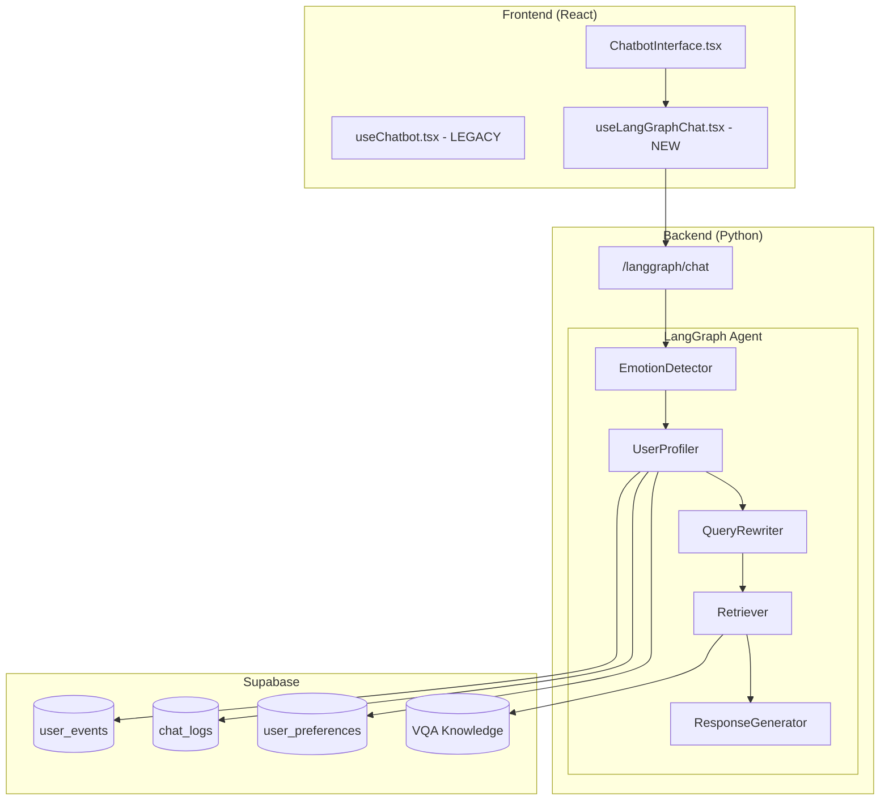

# LangGraph Chatbot Refactor - Implementation Plan

## Mục tiêu

Thay thế hoàn toàn logic chatbot cũ bằng hệ thống mới với:
1. **LangGraph** - State machine cho conversation flow
2. **Emotion-based responses** - Phản hồi theo cảm xúc user
3. **Personalized suggestions** - Gợi ý dựa trên lịch sử user
4. **User profile** - Tích hợp sở thích, thói quen từ history

---

## Kiến trúc mới



---

## Database đã có (Đã migrate)

| Table | Columns | Dùng cho |
|-------|---------|----------|
| `user_events` | `event_type`, `object_id`, `payload`, `score` | Tracking search/click |
| `chat_logs` | `message`, `context`, `feedback_score` | Conversation history |
| `user_preferences` | `travel_style`, `preferred_cities`, `last_detected_emotion` | User profile |

---

## Proposed Changes

### Phase 1: LangGraph Backend

#### [NEW] `python/langgraph_agent/`

```
python/langgraph_agent/
├── __init__.py
├── graph.py           # LangGraph state machine
├── nodes/
│   ├── emotion.py     # Phát hiện emotion từ message
│   ├── profiler.py    # Load user profile từ DB
│   ├── rewriter.py    # Viết lại query ngắn
│   ├── retriever.py   # Tìm kiếm trong VQA DB
│   └── generator.py   # Sinh response
├── state.py           # AgentState dataclass
└── prompts.py         # Prompt templates
```

#### LangGraph State

```python
@dataclass
class AgentState:
    # Input
    user_id: str
    session_id: str
    message: str
    history: List[Dict]
    
    # Detected
    emotion: str = "neutral"  # calm, excited, curious, frustrated
    
    # User Profile (from DB)
    preferred_cities: List[str] = []
    travel_style: str = ""  # adventure, relaxation, culture
    recent_searches: List[str] = []
    top_interests: List[str] = []  # Extracted from history
    
    # Processing
    rewritten_query: str = ""
    retrieved_context: List[Dict] = []
    
    # Output
    response: str = ""
    suggested_prompts: List[str] = []  # Custom suggestions
```

---

### Phase 2: Personalization Features

#### 2.1 Emotion-based Response

```python
# nodes/emotion.py
async def detect_emotion(state: AgentState) -> AgentState:
    """Detect emotion from message + history"""
    prompt = f"""
    Phân tích emotion của user từ tin nhắn:
    "{state.message}"
    
    History gần đây:
    {format_history(state.history[-3:])}
    
    Return: calm | excited | curious | frustrated | neutral
    """
    # Call Gemini → update state.emotion
```

**Response adjustment:**
- `calm` → Trả lời chi tiết, từ tốn
- `excited` → Dùng emoji, ngắn gọn, năng động
- `curious` → Cung cấp nhiều thông tin bổ sung
- `frustrated` → Xin lỗi, hỏi rõ yêu cầu

---

#### 2.2 Personalized Suggestions (Thay mock)

**Hiện tại (mock):**
```
Gợi ý địa điểm du lịch biển
Đà Nẵng có gì hay?
Địa điểm du lịch miền Trung
```

**Mới (từ user history):**
```python
# nodes/profiler.py
async def load_user_profile(state: AgentState) -> AgentState:
    # Query user_events for recent searches
    events = await supabase.from_('user_events') \
        .select('object_id, payload, score') \
        .eq('user_id', state.user_id) \
        .order('created_at', desc=True) \
        .limit(50)
    
    # Extract interests
    state.top_interests = extract_top_interests(events)  # ["biển", "Đà Nẵng", "resort"]
    state.recent_searches = extract_recent_searches(events)
    
    # Load preferences
    prefs = await supabase.from_('user_preferences').select('*')...
    state.travel_style = prefs.travel_style
    state.preferred_cities = prefs.preferred_cities
    
    return state

def generate_suggestions(state: AgentState) -> List[str]:
    """Generate personalized suggestions"""
    suggestions = []
    
    if "biển" in state.top_interests:
        suggestions.append(f"Bãi biển đẹp gần {state.preferred_cities[0] or 'Đà Nẵng'}")
    
    if state.travel_style == "adventure":
        suggestions.append("Tour leo núi hoặc khám phá hang động")
    
    if "Hạ Long" in state.recent_searches:
        suggestions.append("Lịch trình 2 ngày 1 đêm Hạ Long")
    
    return suggestions[:3]
```

---

#### 2.3 Context from History

```python
# nodes/profiler.py
async def extract_user_insights(state: AgentState) -> Dict:
    """Extract user habits/preferences from chat history"""
    
    # Get last 20 conversations
    logs = await supabase.from_('chat_logs') \
        .select('message, context') \
        .eq('user_id', state.user_id) \
        .order('created_at', desc=True) \
        .limit(20)
    
    # Analyze with LLM
    prompt = f"""
    Phân tích lịch sử chat của user để rút ra:
    1. Sở thích du lịch (biển, núi, văn hóa...)
    2. Phong cách (tiết kiệm, sang trọng, mạo hiểm)
    3. Địa điểm thường hỏi
    4. Thời điểm thường đi (cuối tuần, nghỉ lễ...)
    
    History:
    {format_logs(logs)}
    
    Return JSON:
    """
    
    return await gemini_analyze(prompt)
```

---

### Phase 3: API Endpoint

#### [NEW] `/langgraph/chat`

```python
class LangGraphChatRequest(BaseModel):
    user_id: str
    session_id: str
    message: str
    history: List[Dict] = []

@app.post("/langgraph/chat")
async def langgraph_chat(req: LangGraphChatRequest):
    """Main chat endpoint using LangGraph agent"""
    
    # Run LangGraph
    result = await run_agent_graph(
        user_id=req.user_id,
        session_id=req.session_id,
        message=req.message,
        history=req.history
    )
    
    return {
        "response": result.response,
        "emotion": result.emotion,
        "suggested_prompts": result.suggested_prompts,  # Personalized!
        "debug": {
            "rewritten_query": result.rewritten_query,
            "travel_style": result.travel_style,
            "top_interests": result.top_interests
        }
    }
```

---

### Phase 4: Frontend Integration

#### [LEGACY] `useChatbot.tsx`

```typescript
// Đánh dấu deprecated, giữ lại cho reference
/** @deprecated Use useLangGraphChat instead */
export function useChatbot() { ... }
```

#### [NEW] `useLangGraphChat.tsx`

```typescript
export function useLangGraphChat() {
    const sendMessage = async (content: string) => {
        const response = await fetch('/langgraph/chat', {
            method: 'POST',
            body: JSON.stringify({
                user_id: user.id,
                session_id: sessionIdRef.current,
                message: content,
                history: messages.slice(-6)
            })
        });
        
        const data = await response.json();
        
        // Update suggested prompts (personalized)
        setSuggestedPrompts(data.suggested_prompts);
        
        // Adjust UI based on emotion
        setCurrentEmotion(data.emotion);
    };
    
    return { sendMessage, suggestedPrompts, currentEmotion, ... };
}
```

---

## Verification Plan

### Unit Tests

```python
# tests/test_emotion.py
def test_emotion_detection():
    assert detect_emotion("Tuyệt vời!") == "excited"
    assert detect_emotion("Hmm, không hiểu lắm") == "curious"

# tests/test_profiler.py  
def test_suggestions_based_on_history():
    # User searched for beaches → suggest beach
    state = AgentState(top_interests=["biển", "resort"])
    suggestions = generate_suggestions(state)
    assert any("biển" in s for s in suggestions)
```

### Manual Testing

| Scenario | Expected |
|----------|----------|
| User có history tìm biển | Gợi ý: "Bãi biển đẹp gần [city]" |
| User đang excited | Response ngắn + emoji |
| User mới (no history) | Gợi ý generic nhưng smart |

---

## Implementation Order

| Phase | Tasks | Time |
|-------|-------|------|
| 1 | Create `langgraph_agent/` structure | 2h |
| 2 | Implement nodes: emotion, profiler, rewriter | 3h |
| 3 | Build LangGraph graph + API endpoint | 2h |
| 4 | Create `useLangGraphChat.tsx` | 2h |
| 5 | Mark old hook as legacy, integrate new | 1h |
| 6 | Testing + fixes | 2h |

**Total: ~12 hours**

---

## User Review Required

> [!IMPORTANT]
> 1. **LangGraph dependency** - Cần cài `langgraph` package (`pip install langgraph`)
> 2. **Supabase access** - Backend cần access Supabase để query user history
> 3. **Gemini API calls** - Mỗi message có thể gọi 2-3 lần Gemini (emotion + rewrite + generate)

Bạn có muốn điều chỉnh gì trước khi tôi bắt đầu implement không?
