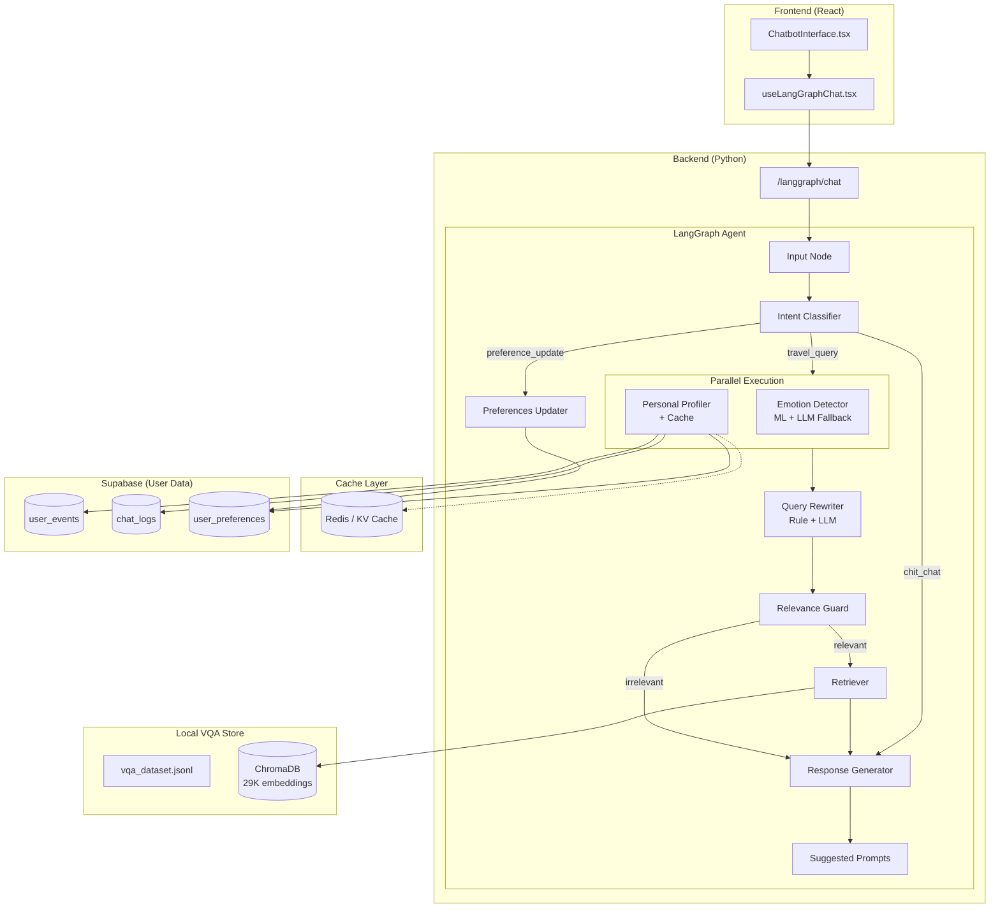
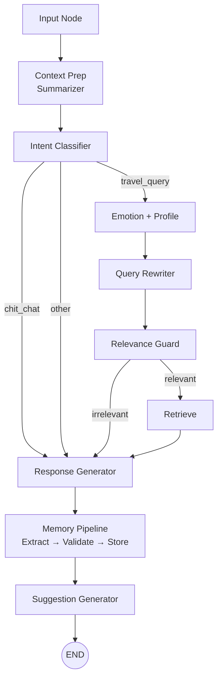

# LangGraph Chatbot Refactor - Implementation Plan

## Mục tiêu

Thay thế hoàn toàn logic chatbot cũ bằng hệ thống mới với:
1. **LangGraph** - State machine cho conversation flow
2. **Emotion-based responses** - Phản hồi theo cảm xúc user
3. **Personalized suggestions** - Gợi ý dựa trên lịch sử user
4. **User profile** - Tích hợp sở thích, thói quen từ history

---

## Kiến trúc cải tiến (v2)

> [!IMPORTANT]
> Kiến trúc này đã được cải thiện dựa trên feedback về scalability, correctness, maintainability và performance.



---

## Cải tiến kiến trúc

### ✅ Điểm mạnh giữ nguyên
- LangGraph cho multi-step orchestration
- Phân tách module rõ ràng (Single Responsibility)
- Tích hợp personalization từ DB
- API/FE separation tốt

### 🔧 Cải tiến mới

| Hạng mục                  | Trước           | Sau                              |
| ------------------------- | --------------- | -------------------------------- |
| **Intent Classification** | ❌ Không có      | ✅ Thêm Intent Classifier         |
| **Parallel Execution**    | Tuần tự         | Emotion + Profile chạy song song |
| **Emotion Detection**     | LLM only        | ML-based + LLM fallback          |
| **Query Rewrite**         | LLM only        | Rule-based + LLM hybrid          |
| **Relevance Guard**       | ❌ Không có      | ✅ Filter off-topic queries       |
| **Profile Cache**         | ❌ Query mỗi lần | ✅ Cache 30 phút                  |
| **Preferences Update**    | ❌ Chỉ đọc       | ✅ Tự động cập nhật từ chat       |
| **State Management**      | Monolithic      | Tách thành 3 state objects       |

---

## Data Sources

### User Data (Supabase)

| Table              | Columns                                                     | Dùng cho              |
| ------------------ | ----------------------------------------------------------- | --------------------- |
| `user_events`      | `event_type`, `object_id`, `payload`, `score`               | Tracking search/click |
| `chat_logs`        | `message`, `context`, `feedback_score`                      | Conversation history  |
| `user_preferences` | `travel_style`, `preferred_cities`, `last_detected_emotion` | User profile          |

### VQA Knowledge (Local - Pet Project Simplification)

> [!TIP]
> **Thay thế Supabase VQA** bằng local JSONL + ChromaDB để đơn giản hóa cho pet project.

**Source:** `/Data/vqa_dataset.jsonl` (29,760 VQA pairs)

```
Data Structure:
├── image_id: "IMG000002"
├── file_path: "a-pa-chai-.../xxx.jpg"
├── image_url: "https://..."
└── vqa_pairs: [
    {
        "question": "Nội dung chính của bức ảnh?",
        "answers": ["Bức ảnh chụp Cột cờ A Pa Chải..."],
        "answer_type": "Image Description"
    },
    ...
]
```

#### Local Vector Store Setup

```python
# retrieval/vqa_store.py
from chromadb import PersistentClient
from sentence_transformers import SentenceTransformer
import json

class VQAVectorStore:
    """
    Local vector store for VQA retrieval.
    Uses ChromaDB + SBERT embeddings instead of Supabase.
    """
    
    def __init__(
        self, 
        persist_path: str = "./data/chroma_vqa",
        model_name: str = "sentence-transformers/paraphrase-multilingual-MiniLM-L12-v2"
    ):
        self.client = PersistentClient(path=persist_path)
        self.collection = self.client.get_or_create_collection(
            name="vqa_knowledge",
            metadata={"hnsw:space": "cosine"}
        )
        self.encoder = SentenceTransformer(model_name)
        
    def index_from_jsonl(self, jsonl_path: str) -> int:
        """
        One-time indexing from vqa_dataset.jsonl.
        Run once at startup or when data changes.
        """
        if self.collection.count() > 0:
            print(f"Already indexed {self.collection.count()} documents")
            return self.collection.count()
        
        documents = []
        metadatas = []
        ids = []
        
        with open(jsonl_path, 'r', encoding='utf-8') as f:
            for line in f:
                item = json.loads(line)
                for vqa in item.get("vqa_pairs", []):
                    # Combine Q+A for richer embeddings
                    doc_text = f"{vqa['question']}\n{vqa['answers'][0]}"
                    documents.append(doc_text)
                    metadatas.append({
                        "image_id": item["image_id"],
                        "question": vqa["question"],
                        "answer": vqa["answers"][0],
                        "answer_type": vqa.get("answer_type", ""),
                        "image_url": item.get("image_url", "")
                    })
                    ids.append(vqa["question_id"])
        
        # Batch insert
        batch_size = 1000
        for i in range(0, len(documents), batch_size):
            batch_docs = documents[i:i+batch_size]
            batch_ids = ids[i:i+batch_size]
            batch_meta = metadatas[i:i+batch_size]
            
            embeddings = self.encoder.encode(batch_docs).tolist()
            self.collection.add(
                documents=batch_docs,
                embeddings=embeddings,
                metadatas=batch_meta,
                ids=batch_ids
            )
        
        return len(documents)
    
    def search(self, query: str, k: int = 5) -> List[Dict]:
        """
        Semantic search for relevant VQA pairs.
        Returns top-k matches with score.
        """
        query_embedding = self.encoder.encode(query).tolist()
        
        results = self.collection.query(
            query_embeddings=[query_embedding],
            n_results=k,
            include=["documents", "metadatas", "distances"]
        )
        
        matches = []
        for i in range(len(results["ids"][0])):
            matches.append({
                "id": results["ids"][0][i],
                "question": results["metadatas"][0][i]["question"],
                "answer": results["metadatas"][0][i]["answer"],
                "answer_type": results["metadatas"][0][i]["answer_type"],
                "image_url": results["metadatas"][0][i].get("image_url", ""),
                "score": 1 - results["distances"][0][i]  # cosine → similarity
            })
        
        return matches

# Singleton instance
vqa_store = VQAVectorStore()

# Index on startup (one-time)
def init_vqa_store(jsonl_path: str = "./Data/vqa_dataset.jsonl"):
    count = vqa_store.index_from_jsonl(jsonl_path)
    print(f"VQA store ready with {count} documents")
```

#### Retriever Node (Using Local Store)

```python
# nodes/retriever.py

async def retrieve_context(state: MessageProcessingState) -> MessageProcessingState:
    """
    Retrieve relevant VQA context from local ChromaDB.
    Replaces Supabase DB4 queries.
    """
    
    if not state.is_relevant:
        state.retrieved_context = []
        return state
    
    # Search local vector store
    matches = vqa_store.search(
        query=state.rewritten_query,
        k=5
    )
    
    # Filter by score threshold
    MIN_SCORE = 0.5
    relevant = [m for m in matches if m["score"] >= MIN_SCORE]
    
    state.retrieved_context = relevant
    return state
```

---

## Proposed Changes

### Phase 1: LangGraph Backend Structure

#### [NEW] `Backend/langgraph_agent/`

> [!NOTE]
> Deployment folder: `/home/qhuy/TourismChatbot/TourismChatbot/Backend`

```
Backend/
├── requirements.txt          # Python dependencies
├── main.py                   # FastAPI entry point
├── langgraph_agent/
│   ├── __init__.py
│   ├── graph.py              # LangGraph state machine
│   ├── nodes/
│   │   ├── __init__.py
│   │   ├── intent.py         # Intent classification
│   │   ├── emotion.py        # ML-based + Gemini fallback
│   │   ├── profiler.py       # Load user profile + cache
│   │   ├── rewriter.py       # Rule-based + Gemini hybrid
│   │   ├── guard.py          # Relevance filter
│   │   ├── retriever.py      # VQA knowledge search (ChromaDB)
│   │   ├── generator.py      # Response generation (Gemini)
│   │   ├── summarizer.py     # Conversation summarizer
│   │   └── suggestions.py    # Categorized suggestions
│   ├── memory/
│   │   ├── __init__.py
│   │   ├── extractor.py      # Memory fact extraction
│   │   ├── validator.py      # Memory validation
│   │   └── store.py          # Memory storage (Supabase)
│   ├── retrieval/
│   │   ├── __init__.py
│   │   └── vqa_store.py      # ChromaDB vector store
│   ├── state.py              # Split state objects
│   ├── prompts.py            # Prompt templates (Gemini)
│   ├── cache.py              # Redis cache wrapper
│   └── utils/
│       ├── __init__.py
│       ├── rule_engine.py    # Rule-based rewrite
│       ├── validators.py     # Response validation
│       └── gemini_client.py  # Gemini API wrapper
```

#### Gemini API Client (utils/gemini_client.py)

> [!IMPORTANT]
> **Chỉ dùng Gemini API** - KHÔNG dùng OpenAI hay bất kỳ LLM provider khác.

```python
# utils/gemini_client.py
import os
from typing import Optional, List, Dict
import google.generativeai as genai
from tenacity import retry, stop_after_attempt, wait_exponential

# Configure Gemini
genai.configure(api_key=os.getenv("GEMINI_API_KEY"))

# Models
TEXT_MODEL = "gemini-1.5-flash"  # Fast, cheap for simple tasks
PRO_MODEL = "gemini-1.5-pro"     # Complex reasoning

class GeminiClient:
    """
    Centralized Gemini API wrapper.
    All LLM calls go through this client.
    """
    
    def __init__(self, model_name: str = TEXT_MODEL):
        self.model = genai.GenerativeModel(model_name)
    
    @retry(stop=stop_after_attempt(3), wait=wait_exponential(min=1, max=10))
    async def generate(
        self,
        prompt: str,
        system_instruction: Optional[str] = None,
        temperature: float = 0.7,
        max_tokens: int = 1024
    ) -> str:
        """Generate text completion"""
        generation_config = {
            "temperature": temperature,
            "max_output_tokens": max_tokens,
        }
        
        if system_instruction:
            model = genai.GenerativeModel(
                model_name=self.model.model_name,
                system_instruction=system_instruction
            )
        else:
            model = self.model
        
        response = await model.generate_content_async(
            prompt,
            generation_config=generation_config
        )
        
        return response.text
    
    async def generate_json(
        self,
        prompt: str,
        schema: Dict,
        temperature: float = 0.3
    ) -> Dict:
        """Generate structured JSON output"""
        json_prompt = f"""
{prompt}

Trả về JSON theo schema:
{schema}

CHỈ trả về JSON, không có text khác.
"""
        response = await self.generate(json_prompt, temperature=temperature)
        
        # Parse JSON (với fallback)
        import json
        try:
            return json.loads(response.strip())
        except json.JSONDecodeError:
            # Try to extract JSON from response
            import re
            match = re.search(r'\{.*\}', response, re.DOTALL)
            if match:
                return json.loads(match.group())
            raise

# Singleton instances
gemini_fast = GeminiClient(TEXT_MODEL)  # For intent, emotion, rewrite
gemini_pro = GeminiClient(PRO_MODEL)    # For complex generation
```

---

### Phase 2: State Management (Tách State)

> [!TIP]
> Tách state thành 3 object riêng để tránh phình to và dễ maintain.

```python
from dataclasses import dataclass, field
from typing import List, Dict, Literal

IntentType = Literal["travel_query", "chit_chat", "preference_update", "negative_feedback", "meta_instruction"]
EmotionType = Literal["calm", "excited", "curious", "frustrated", "neutral"]

@dataclass
class UserContextState:
    """User-related context (cached 30 mins)"""
    user_id: str
    session_id: str
    
    # From DB
    preferred_cities: List[str] = field(default_factory=list)
    travel_style: str = ""  # adventure, relaxation, culture
    recent_searches: List[str] = field(default_factory=list)
    top_interests: List[str] = field(default_factory=list)
    
    # Cache metadata
    cache_key: str = ""
    cache_ttl: int = 1800  # 30 minutes

@dataclass
class MessageProcessingState:
    """Per-message processing state"""
    message: str
    history: List[Dict] = field(default_factory=list)
    
    # Short-term context (ChatGPT-style)
    conversation_summary: str = ""  # Compressed older turns
    recent_turns: List[Dict] = field(default_factory=list)  # Last 6 turns raw
    
    # Detected
    intent: IntentType = "travel_query"
    emotion: EmotionType = "neutral"
    emotion_confidence: float = 0.0
    
    # Processing
    rewritten_query: str = ""
    rewrite_method: str = ""  # "rule" or "llm"
    is_relevant: bool = True
    retrieved_context: List[Dict] = field(default_factory=list)

@dataclass
class OutputState:
    """Response output state"""
    response: str = ""
    suggested_prompts: List[Dict] = field(default_factory=list)  # Categorized
    preferences_updated: bool = False
    
    # Memory updates
    memory_updated: bool = False
    memory_facts_stored: int = 0
    
    debug_info: Dict = field(default_factory=dict)
```

#### 2.1 Conversation Summarizer (Short-term Context)

> [!IMPORTANT]
> **ChatGPT không bao giờ nhét toàn bộ lịch sử vào prompt.** Thay vào đó:
> - Load **6 turns gần nhất** raw
> - Load **summary** của các turns cũ hơn

```python
# nodes/summarizer.py

MAX_RAW_TURNS = 6  # Keep last 6 turns raw
SUMMARY_THRESHOLD = 12  # Start summarizing after 12 turns

async def summarize_conversation(history: List[Dict]) -> str:
    """
    Summarize older conversation turns.
    Only called when history > SUMMARY_THRESHOLD
    """
    if len(history) <= MAX_RAW_TURNS:
        return ""
    
    # Get turns to summarize (excluding recent ones)
    older_turns = history[:-MAX_RAW_TURNS]
    
    prompt = f"""
    Tóm tắt cuộc hội thoại sau thành 2-3 câu ngắn gọn.
    Chỉ giữ lại thông tin QUAN TRỌNG: chủ đề chính, yêu cầu user, thông tin đã cung cấp.
    
    Hội thoại:
    {format_turns(older_turns)}
    
    Tóm tắt:
    """
    
    return await gemini_call(prompt)

def build_context_window(
    message: str,
    history: List[Dict],
    summary: str
) -> str:
    """
    Build final context for LLM.
    Structure:
    1. Summary of older turns (if exists)
    2. Last 6 turns raw
    3. Current message
    """
    context_parts = []
    
    # 1. Summary of older conversation
    if summary:
        context_parts.append(f"[Tóm tắt hội thoại trước]: {summary}")
    
    # 2. Recent turns (raw)
    recent = history[-MAX_RAW_TURNS:] if len(history) > MAX_RAW_TURNS else history
    for turn in recent:
        role = "User" if turn["role"] == "user" else "Bot"
        context_parts.append(f"{role}: {turn['content']}")
    
    # 3. Current message
    context_parts.append(f"User: {message}")
    
    return "\n".join(context_parts)

async def prepare_context(state: MessageProcessingState) -> MessageProcessingState:
    """
    LangGraph node: Prepare context with summarization.
    Called BEFORE main processing.
    """
    
    # Check if summarization needed
    if len(state.history) > SUMMARY_THRESHOLD and not state.conversation_summary:
        state.conversation_summary = await summarize_conversation(state.history)
    
    # Split history
    state.recent_turns = state.history[-MAX_RAW_TURNS:] if len(state.history) > MAX_RAW_TURNS else state.history
    
    return state
```

---

### Phase 3: Node Implementations

#### 3.1 Intent Classifier (NEW)

```python
# nodes/intent.py
from typing import Tuple

INTENT_KEYWORDS = {
    "travel_query": ["đi", "du lịch", "địa điểm", "khách sạn", "tour", "vé"],
    "chit_chat": ["bạn là ai", "xin chào", "tạm biệt", "cảm ơn"],
    "preference_update": ["cập nhật sở thích", "thích đi", "không thích"],
    "negative_feedback": ["tệ quá", "không hài lòng", "sai rồi"],
}

def classify_intent_rule_based(message: str) -> Tuple[IntentType, float]:
    """Fast rule-based intent classification"""
    message_lower = message.lower()
    
    for intent, keywords in INTENT_KEYWORDS.items():
        if any(kw in message_lower for kw in keywords):
            return intent, 0.9
    
    return "travel_query", 0.5  # Default with low confidence

async def classify_intent(state: MessageProcessingState) -> MessageProcessingState:
    """Hybrid intent classification: Rule → LLM fallback"""
    intent, confidence = classify_intent_rule_based(state.message)
    
    if confidence < 0.7:
        # LLM fallback for ambiguous cases
        intent = await llm_classify_intent(state.message, state.history)
        confidence = 0.85
    
    state.intent = intent
    return state
```

#### 3.2 Emotion Detection (ML + LLM Fallback)

> [!TIP]
> Sử dụng ML model nhẹ (DistilBERT Vietnamese) để giảm 70-90% cost Gemini.

```python
# nodes/emotion.py
from transformers import pipeline

# Load once at startup
emotion_classifier = pipeline(
    "sentiment-analysis", 
    model="vanadhi/robBERT-vi-sentiment"  # Vietnamese sentiment
)

EMOTION_MAPPING = {
    "positive": "excited",
    "negative": "frustrated", 
    "neutral": "neutral"
}

def detect_emotion_ml(message: str) -> Tuple[EmotionType, float]:
    """Fast ML-based emotion detection"""
    result = emotion_classifier(message)[0]
    emotion = EMOTION_MAPPING.get(result["label"], "neutral")
    return emotion, result["score"]

async def detect_emotion(state: MessageProcessingState) -> MessageProcessingState:
    """Hybrid: ML → LLM fallback for low confidence"""
    emotion, confidence = detect_emotion_ml(state.message)
    
    if confidence < 0.6:
        # LLM fallback for nuanced emotions
        emotion = await llm_detect_emotion(state.message, state.history)
        confidence = 0.8
    
    state.emotion = emotion
    state.emotion_confidence = confidence
    
    # Validate output (prevent LLM format errors)
    if state.emotion not in ["calm", "excited", "curious", "frustrated", "neutral"]:
        state.emotion = "neutral"
    
    return state
```

#### 3.3 Query Rewriter (Rule + LLM Hybrid)

```python
# nodes/rewriter.py

def needs_rewrite(message: str) -> bool:
    """Check if message needs rewriting"""
    # Short confirmations don't need rewrite
    if len(message.split()) <= 3:
        return False
    # Already has travel entity
    if contains_travel_entity(message):
        return False
    return True

def rewrite_rule_based(message: str, context: List[Dict]) -> str:
    """Fast rule-based rewrite for simple cases"""
    short_replies = {
        "có": "Có, tôi muốn biết thêm về {last_topic}",
        "ok": "Đồng ý, cho tôi thêm thông tin về {last_topic}",
        "tiếp": "Tiếp tục về {last_topic}",
    }
    
    message_lower = message.lower().strip()
    if message_lower in short_replies:
        last_topic = extract_last_topic(context)
        return short_replies[message_lower].format(last_topic=last_topic)
    
    return message

async def rewrite_query(state: MessageProcessingState) -> MessageProcessingState:
    """Hybrid rewrite: Rule → LLM for complex cases"""
    
    if not needs_rewrite(state.message):
        state.rewritten_query = state.message
        state.rewrite_method = "skip"
        return state
    
    # Try rule-based first
    rewritten = rewrite_rule_based(state.message, state.history)
    
    if rewritten != state.message:
        state.rewritten_query = rewritten
        state.rewrite_method = "rule"
        return state
    
    # LLM for complex cases
    state.rewritten_query = await llm_rewrite(state.message, state.history)
    state.rewrite_method = "llm"
    return state
```

#### 3.4 Relevance Guard (NEW)

> [!WARNING]
> Bắt buộc để tránh RAG trả lời sai domain.

```python
# nodes/guard.py

TRAVEL_KEYWORDS = ["du lịch", "khách sạn", "địa điểm", "tour", "vé máy bay", 
                   "nhà hàng", "resort", "biển", "núi", "danh lam"]

def is_travel_query(query: str) -> bool:
    """Check if query is travel-related"""
    query_lower = query.lower()
    return any(kw in query_lower for kw in TRAVEL_KEYWORDS)

async def relevance_guard(state: MessageProcessingState) -> MessageProcessingState:
    """Filter out off-topic queries before RAG"""
    
    if state.intent == "chit_chat":
        state.is_relevant = False
        return state
    
    if not is_travel_query(state.rewritten_query):
        # Double check with LLM for edge cases
        is_relevant = await llm_check_relevance(state.rewritten_query)
        state.is_relevant = is_relevant
    else:
        state.is_relevant = True
    
    return state
```

#### 3.5 User Profile with Cache

```python
# nodes/profiler.py
from cache import ProfileCache

cache = ProfileCache(ttl=1800)  # 30 minutes

async def load_user_profile(state: UserContextState) -> UserContextState:
    """Load user profile with caching"""
    
    # Check cache first
    cached = await cache.get(state.user_id)
    if cached:
        state.preferred_cities = cached["preferred_cities"]
        state.travel_style = cached["travel_style"]
        state.recent_searches = cached["recent_searches"]
        state.top_interests = cached["top_interests"]
        return state
    
    # Query DB
    events = await supabase.from_('user_events') \
        .select('object_id, payload, score') \
        .eq('user_id', state.user_id) \
        .order('created_at', desc=True) \
        .limit(50)
    
    prefs = await supabase.from_('user_preferences') \
        .select('*') \
        .eq('user_id', state.user_id) \
        .single()
    
    # Extract and cache
    state.top_interests = extract_top_interests(events)
    state.recent_searches = extract_recent_searches(events)
    state.travel_style = prefs.get("travel_style", "")
    state.preferred_cities = prefs.get("preferred_cities", [])
    
    await cache.set(state.user_id, {
        "preferred_cities": state.preferred_cities,
        "travel_style": state.travel_style,
        "recent_searches": state.recent_searches,
        "top_interests": state.top_interests,
    })
    
    return state
```

#### 3.6 ChatGPT-like Memory System (ENHANCED)

> [!IMPORTANT]
> **Mô hình ChatGPT Memory**: Không lưu raw chat logs, chỉ lưu **facts** được extract và validate.

```
┌─────────────────────────────────────────────────────────────┐
│                    MEMORY PIPELINE                          │
│                                                             │
│  User Message                                               │
│       ↓                                                     │
│  ┌─────────────────┐                                        │
│  │ Memory Extractor│  ← Detect facts từ message             │
│  └────────┬────────┘                                        │
│           ↓                                                 │
│  ┌─────────────────┐                                        │
│  │ Memory Validator│  ← Check: long-term? valid? privacy?   │
│  └────────┬────────┘                                        │
│           ↓                                                 │
│  ┌─────────────────┐                                        │
│  │ Memory Store    │  ← Upsert vào user_preferences         │
│  └─────────────────┘                                        │
└─────────────────────────────────────────────────────────────┘
```

##### 3.6.1 Memory Extractor Node

```python
# nodes/memory/extractor.py
from dataclasses import dataclass
from typing import List, Optional, Literal
from enum import Enum

class MemoryType(str, Enum):
    PREFERENCE = "preference"      # Sở thích: thích biển, núi
    STYLE = "style"                # Phong cách: tiết kiệm, sang trọng
    CONSTRAINT = "constraint"      # Ràng buộc: dị ứng, sợ độ cao
    PERSONAL_INFO = "personal"     # Thông tin cá nhân: tên, nghề nghiệp
    LOCATION = "location"          # Địa điểm quen thuộc: sống ở HN

@dataclass
class ExtractedFact:
    """A fact extracted from user message"""
    type: MemoryType
    key: str                    # e.g. "preferred_travel_style"
    value: str                  # e.g. "adventure"
    confidence: float           # 0.0 - 1.0
    source_message: str         # Original message for audit
    
# Rule-based extraction for common patterns (fast, no LLM)
EXTRACTION_PATTERNS = {
    r"thích\s+(đi\s+)?(biển|núi|văn hóa|mạo hiểm)": ("preference", "travel_type"),
    r"muốn\s+đi\s+(tiết kiệm|sang trọng|bình dân)": ("style", "budget_style"),
    r"sống\s+ở\s+(\w+)": ("location", "home_city"),
    r"tên\s+(là|mình là)\s+(\w+)": ("personal", "name"),
    r"không\s+thích\s+(\w+)": ("constraint", "dislike"),
    r"dị ứng\s+(\w+)": ("constraint", "allergy"),
}

def extract_facts_rule_based(message: str) -> List[ExtractedFact]:
    """Fast rule-based fact extraction"""
    facts = []
    message_lower = message.lower()
    
    for pattern, (fact_type, key) in EXTRACTION_PATTERNS.items():
        match = re.search(pattern, message_lower)
        if match:
            value = match.group(1) if match.lastindex else match.group(0)
            facts.append(ExtractedFact(
                type=MemoryType(fact_type),
                key=key,
                value=value.strip(),
                confidence=0.9,
                source_message=message
            ))
    
    return facts

async def extract_facts_llm(message: str, history: List[Dict]) -> List[ExtractedFact]:
    """LLM-based extraction for complex cases"""
    prompt = f"""
    Phân tích message sau và extract các facts về user (nếu có).
    Chỉ extract thông tin LÂU DÀI, không extract câu hỏi hay thông tin tạm thời.
    
    Message: "{message}"
    
    Context gần đây:
    {format_history(history[-3:])}
    
    Return JSON array:
    [
        {{"type": "preference|style|constraint|personal|location", 
          "key": "tên_field", 
          "value": "giá_trị",
          "confidence": 0.0-1.0}}
    ]
    
    Nếu không có facts → return []
    """
    
    result = await gemini_call(prompt)
    return parse_facts_from_json(result, message)

async def extract_memory(state: MessageProcessingState) -> List[ExtractedFact]:
    """Hybrid extraction: Rule → LLM fallback"""
    
    # 1. Try rule-based first (fast, free)
    facts = extract_facts_rule_based(state.message)
    
    # 2. LLM for complex cases (only if no rule match AND message is substantive)
    if not facts and len(state.message.split()) > 5:
        facts = await extract_facts_llm(state.message, state.history)
    
    return facts
```

##### 3.6.2 Memory Validator Node

```python
# nodes/memory/validator.py
from dataclasses import dataclass

@dataclass
class ValidationResult:
    is_valid: bool
    reason: str
    fact: Optional[ExtractedFact] = None

# Keys that CAN be stored long-term
ALLOWED_KEYS = {
    "travel_type", "budget_style", "home_city", "name",
    "preferred_cities", "travel_companions", "dietary",
    "dislike", "allergy", "interests"
}

# Keys that are SENSITIVE and need extra validation
SENSITIVE_KEYS = {"name", "home_city", "allergy"}

def validate_fact(fact: ExtractedFact) -> ValidationResult:
    """Validate if fact should be stored"""
    
    # 1. Check if key is allowed
    if fact.key not in ALLOWED_KEYS:
        return ValidationResult(
            is_valid=False,
            reason=f"Key '{fact.key}' not in allowed list"
        )
    
    # 2. Check confidence threshold
    if fact.confidence < 0.7:
        return ValidationResult(
            is_valid=False,
            reason=f"Confidence {fact.confidence} < 0.7 threshold"
        )
    
    # 3. Check value not empty
    if not fact.value or len(fact.value.strip()) == 0:
        return ValidationResult(
            is_valid=False,
            reason="Empty value"
        )
    
    # 4. Check value length (prevent injection)
    if len(fact.value) > 200:
        return ValidationResult(
            is_valid=False,
            reason="Value too long (max 200 chars)"
        )
    
    # 5. Sensitive data warning (log only, still valid)
    if fact.key in SENSITIVE_KEYS:
        logger.info(f"Storing sensitive key: {fact.key}")
    
    return ValidationResult(
        is_valid=True,
        reason="Passed all checks",
        fact=fact
    )

async def validate_memory(facts: List[ExtractedFact]) -> List[ExtractedFact]:
    """Validate all extracted facts"""
    valid_facts = []
    
    for fact in facts:
        result = validate_fact(fact)
        if result.is_valid:
            valid_facts.append(fact)
        else:
            logger.debug(f"Rejected fact: {fact.key} - {result.reason}")
    
    return valid_facts
```

##### 3.6.3 Memory Store Updater

```python
# nodes/memory/store.py

# Mapping from fact key to DB column
KEY_TO_COLUMN = {
    "travel_type": "travel_style",
    "budget_style": "travel_style",
    "home_city": "preferred_cities",  # Append to array
    "preferred_cities": "preferred_cities",
    "name": "display_name",
    "dislike": "constraints",
    "allergy": "constraints",
    "interests": "top_interests",
}

async def update_memory_store(
    user_id: str, 
    facts: List[ExtractedFact]
) -> int:
    """
    Store validated facts to Supabase.
    Returns number of facts stored.
    """
    if not facts:
        return 0
    
    updates = {}
    array_appends = {}
    
    for fact in facts:
        column = KEY_TO_COLUMN.get(fact.key, fact.key)
        
        # Array columns need special handling
        if column in ["preferred_cities", "constraints", "top_interests"]:
            if column not in array_appends:
                array_appends[column] = []
            array_appends[column].append(fact.value)
        else:
            updates[column] = fact.value
    
    # Regular updates
    if updates:
        await supabase.from_('user_preferences') \
            .upsert({"user_id": user_id, **updates})
    
    # Array appends (avoid duplicates)
    for column, values in array_appends.items():
        current = await get_current_array(user_id, column)
        new_values = list(set(current + values))
        await supabase.from_('user_preferences') \
            .update({column: new_values}) \
            .eq('user_id', user_id)
    
    # Invalidate cache
    await cache.delete(user_id)
    
    # Log for audit
    logger.info(f"Updated {len(facts)} facts for user {user_id}")
    
    return len(facts)

# Combined node for LangGraph
async def memory_pipeline(state: AgentState) -> AgentState:
    """
    Full memory pipeline: Extract → Validate → Store
    Runs on EVERY message (not just preference_update intent)
    """
    
    # 1. Extract facts from message
    facts = await extract_memory(state.processing)
    
    if not facts:
        state.memory_updated = False
        return state
    
    # 2. Validate facts
    valid_facts = await validate_memory(facts)
    
    if not valid_facts:
        state.memory_updated = False
        return state
    
    # 3. Store to DB
    stored_count = await update_memory_store(
        state.user_context.user_id, 
        valid_facts
    )
    
    state.memory_updated = stored_count > 0
    state.memory_facts_stored = stored_count
    
    return state
```

#### 3.7 Suggestions Generator (SEPARATED NODE)

> [!IMPORTANT]
> **Tách biệt hoàn toàn khỏi Profiler** - dễ test, dễ A/B, FE có thể request riêng.

```python
# nodes/suggestions.py
from dataclasses import dataclass
from typing import List, Optional
from enum import Enum

class SuggestionCategory(str, Enum):
    NEXT_STEP = "next_step"        # Based on current conversation
    PERSONALIZED = "personalized"  # Based on user history
    OPEN_ENDED = "open_ended"      # General inspiration

@dataclass
class Suggestion:
    text: str
    category: SuggestionCategory
    confidence: float = 1.0  # For A/B testing ranking

class SuggestionGenerator:
    """
    INDEPENDENT node - NOT part of Profiler.
    Responsibilities:
    - Generate suggestions based on context + profile
    - Support refresh without full chat call
    - Enable A/B testing different strategies
    """
    
    def __init__(self, strategy: str = "default"):
        self.strategy = strategy  # For A/B testing
    
    def generate(
        self,
        response: str,
        user_state: UserContextState,
        exclude: Optional[List[str]] = None  # For "đổi gợi ý"
    ) -> List[Suggestion]:
        """Generate categorized suggestions"""
        exclude = exclude or []
        suggestions = []
        
        # 1. Next-step prompts (based on current response)
        next_step = self._generate_next_step(response)
        suggestions.extend([s for s in next_step if s.text not in exclude])
        
        # 2. Personalized suggestions (based on history)
        personalized = self._generate_personalized(user_state)
        suggestions.extend([s for s in personalized if s.text not in exclude])
        
        # 3. Open-ended inspiration
        open_ended = self._generate_open_ended(user_state)
        suggestions.extend([s for s in open_ended if s.text not in exclude])
        
        return suggestions[:4]  # Max 4 suggestions
    
    def _generate_next_step(self, response: str) -> List[Suggestion]:
        """Context-aware follow-up suggestions"""
        suggestions = []
        
        if "biển" in response.lower():
            suggestions.append(Suggestion(
                text="Các hoạt động vui chơi ở biển?",
                category=SuggestionCategory.NEXT_STEP
            ))
        if "khách sạn" in response.lower():
            suggestions.append(Suggestion(
                text="So sánh giá khách sạn?",
                category=SuggestionCategory.NEXT_STEP
            ))
        
        return suggestions
    
    def _generate_personalized(self, user_state: UserContextState) -> List[Suggestion]:
        """History-based personalized suggestions"""
        suggestions = []
        
        if user_state.top_interests:
            top = user_state.top_interests[0]
            suggestions.append(Suggestion(
                text=f"Địa điểm {top} đẹp nhất Việt Nam?",
                category=SuggestionCategory.PERSONALIZED
            ))
        
        if user_state.preferred_cities:
            city = user_state.preferred_cities[0]
            suggestions.append(Suggestion(
                text=f"Lịch trình 3 ngày khám phá {city}",
                category=SuggestionCategory.PERSONALIZED
            ))
        
        return suggestions
    
    def _generate_open_ended(self, user_state: UserContextState) -> List[Suggestion]:
        """General inspiration suggestions"""
        pool = [
            "Gợi ý địa điểm du lịch cuối tuần?",
            "Địa điểm phù hợp cho gia đình?",
            "Tour du lịch giá rẻ tháng này?",
            "Điểm đến trending năm 2025?",
        ]
        # Rotate based on some factor (time, random, etc)
        return [Suggestion(text=pool[0], category=SuggestionCategory.OPEN_ENDED)]

# Node function for LangGraph
suggestion_generator = SuggestionGenerator()

async def generate_suggestions_node(state: AgentState) -> AgentState:
    """LangGraph node - INDEPENDENT from profiler"""
    state.suggested_prompts = suggestion_generator.generate(
        response=state.response,
        user_state=state.user_context,
        exclude=state.previous_suggestions  # For refresh
    )
    return state
```

---

### Phase 4: LangGraph Flow (Updated with Memory + Summarizer)



```python
# graph.py
from langgraph.graph import StateGraph, END

def build_graph():
    workflow = StateGraph(AgentState)
    
    # Add nodes
    workflow.add_node("input", input_node)
    workflow.add_node("context", prepare_context)        # NEW: Summarizer
    workflow.add_node("intent", classify_intent)
    workflow.add_node("emotion", detect_emotion)
    workflow.add_node("profile", load_user_profile)
    workflow.add_node("rewrite", rewrite_query)
    workflow.add_node("guard", relevance_guard)
    workflow.add_node("retrieve", retrieve_context)
    workflow.add_node("generate", generate_response)
    workflow.add_node("memory", memory_pipeline)         # NEW: Memory Extract→Validate→Store
    workflow.add_node("suggestions", generate_suggestions_node)
    
    # Entry point
    workflow.set_entry_point("input")
    
    # Sequential: input → context → intent
    workflow.add_edge("input", "context")
    workflow.add_edge("context", "intent")
    
    # Conditional: intent routing
    workflow.add_conditional_edges(
        "intent",
        route_by_intent,
        {
            "travel_query": "parallel_nodes",
            "chit_chat": "generate",
            "preference_update": "generate",  # Memory pipeline handles extraction
            "negative_feedback": "generate",
        }
    )
    
    # Parallel execution: emotion + profile
    workflow.add_node("parallel_nodes", parallel_emotion_profile)
    workflow.add_edge("parallel_nodes", "rewrite")
    
    # Sequential: rewrite → guard → retrieve → generate
    workflow.add_edge("rewrite", "guard")
    workflow.add_conditional_edges(
        "guard",
        lambda s: "retrieve" if s.is_relevant else "generate",
        {"retrieve": "retrieve", "generate": "generate"}
    )
    workflow.add_edge("retrieve", "generate")
    
    # Post-generate: memory → suggestions → END
    workflow.add_edge("generate", "memory")           # Memory runs on EVERY response
    workflow.add_edge("memory", "suggestions")
    workflow.add_edge("suggestions", END)
    
    return workflow.compile()


# Helper: Parallel emotion + profile execution
async def parallel_emotion_profile(state: AgentState) -> AgentState:
    """Run emotion detection and profile loading in parallel"""
    emotion_task = asyncio.create_task(detect_emotion(state.processing))
    profile_task = asyncio.create_task(load_user_profile(state.user_context))
    
    await asyncio.gather(emotion_task, profile_task)
    return state
```

---

### Phase 5: API Endpoint

```python
# api.py
from pydantic import BaseModel
from typing import List, Dict, Optional

class LangGraphChatRequest(BaseModel):
    user_id: str
    session_id: str
    message: str
    history: List[Dict] = []

class SuggestionResponse(BaseModel):
    text: str
    category: str

class LangGraphChatResponse(BaseModel):
    response: str
    emotion: str
    suggested_prompts: List[SuggestionResponse]
    preferences_updated: bool
    debug: Optional[Dict] = None

@app.post("/langgraph/chat", response_model=LangGraphChatResponse)
async def langgraph_chat(req: LangGraphChatRequest):
    """Main chat endpoint using LangGraph agent"""
    
    # Rate limiting
    if not await rate_limiter.allow(req.user_id):
        raise HTTPException(429, "Too many requests")
    
    result = await run_agent_graph(
        user_id=req.user_id,
        session_id=req.session_id,
        message=req.message,
        history=req.history
    )
    
    return LangGraphChatResponse(
        response=result.response,
        emotion=result.emotion,
        suggested_prompts=[
            SuggestionResponse(text=s.text, category=s.category)
            for s in result.suggested_prompts
        ],
        preferences_updated=result.preferences_updated,
        debug={
            "intent": result.intent,
            "rewritten_query": result.rewritten_query,
            "rewrite_method": result.rewrite_method,
            "is_relevant": result.is_relevant,
            "travel_style": result.travel_style,
            "top_interests": result.top_interests
        } if settings.DEBUG else None
    )
```

#### 5.2 Suggestions Refresh Endpoint (NEW)

> [!TIP]
> FE có thể gọi riêng để "đổi gợi ý" mà không cần full chat call.

```python
class RefreshSuggestionsRequest(BaseModel):
    user_id: str
    session_id: str
    last_response: str  # Last bot response for context
    exclude: List[str] = []  # Previously shown suggestions to exclude

@app.post("/langgraph/suggestions", response_model=List[SuggestionResponse])
async def refresh_suggestions(req: RefreshSuggestionsRequest):
    """
    Refresh suggestions without full chat call.
    Use cases:
    - User clicks "đổi gợi ý"
    - Auto-refresh after X seconds
    - A/B testing different suggestion strategies
    """
    
    # Load cached user profile (no DB hit if cached)
    user_state = await load_cached_profile(req.user_id)
    
    # Generate new suggestions excluding previous ones
    new_suggestions = suggestion_generator.generate(
        response=req.last_response,
        user_state=user_state,
        exclude=req.exclude
    )
    
    return [
        SuggestionResponse(text=s.text, category=s.category.value)
        for s in new_suggestions
    ]
```

---

### Phase 6: Frontend Integration

```typescript
// hooks/useLangGraphChat.tsx
interface Suggestion {
    text: string;
    category: 'next_step' | 'personalized' | 'open_ended';
}

export function useLangGraphChat() {
    const [suggestions, setSuggestions] = useState<Suggestion[]>([]);
    const [emotion, setEmotion] = useState<string>('neutral');
    
    const sendMessage = async (content: string) => {
        const response = await fetch('/langgraph/chat', {
            method: 'POST',
            headers: { 'Content-Type': 'application/json' },
            body: JSON.stringify({
                user_id: user.id,
                session_id: sessionIdRef.current,
                message: content,
                history: messages.slice(-6)
            })
        });
        
        const data = await response.json();
        
        // Update categorized suggestions
        setSuggestions(data.suggested_prompts);
        
        // Adjust UI based on emotion
        setEmotion(data.emotion);
        
        return data.response;
    };
    
    // Group suggestions by category for UI
    const groupedSuggestions = useMemo(() => ({
        nextStep: suggestions.filter(s => s.category === 'next_step'),
        personalized: suggestions.filter(s => s.category === 'personalized'),
        openEnded: suggestions.filter(s => s.category === 'open_ended'),
    }), [suggestions]);
    
    return { sendMessage, groupedSuggestions, emotion };
}
```

---

## Verification Plan

### Unit Tests

```python
# tests/test_intent.py
def test_intent_classification():
    assert classify_intent_rule_based("Đà Nẵng có gì hay?")[0] == "travel_query"
    assert classify_intent_rule_based("bạn là ai?")[0] == "chit_chat"
    assert classify_intent_rule_based("cập nhật sở thích của tôi")[0] == "preference_update"

# tests/test_emotion.py
def test_emotion_ml():
    assert detect_emotion_ml("Tuyệt vời quá!")[0] == "excited"
    assert detect_emotion_ml("Không hiểu lắm...")[0] in ["frustrated", "neutral"]

# tests/test_rewriter.py
def test_rule_based_rewrite():
    context = [{"role": "user", "content": "Đà Nẵng có gì hay?"}]
    assert "Đà Nẵng" in rewrite_rule_based("tiếp", context)

# tests/test_guard.py
def test_relevance_guard():
    assert is_travel_query("Khách sạn ở Hà Nội") == True
    assert is_travel_query("Tính diện tích hình tròn") == False

# tests/test_cache.py
async def test_profile_cache():
    await cache.set("user_1", {"travel_style": "adventure"})
    cached = await cache.get("user_1")
    assert cached["travel_style"] == "adventure"
```

### Integration Tests

```python
# tests/test_integration.py
async def test_full_flow_travel_query():
    result = await run_agent_graph(
        user_id="test_user",
        session_id="test_session",
        message="Đà Nẵng có gì hay?",
        history=[]
    )
    assert result.response != ""
    assert result.intent == "travel_query"
    assert len(result.suggested_prompts) > 0

async def test_chit_chat_bypass_rag():
    result = await run_agent_graph(
        user_id="test_user",
        session_id="test_session",
        message="Bạn là ai?",
        history=[]
    )
    assert result.intent == "chit_chat"
    assert result.is_relevant == False  # Skipped RAG
```

### Manual Testing

| Scenario                          | Expected                             |
| --------------------------------- | ------------------------------------ |
| User có history tìm biển          | Gợi ý: "Bãi biển đẹp gần [city]"     |
| User đang excited                 | Response ngắn + emoji                |
| User mới (no history)             | Gợi ý generic nhưng smart            |
| Query "tính diện tích"            | Trả lời ngoài domain, không dùng RAG |
| "Cập nhật sở thích tôi thích núi" | DB updated + cache invalidated       |

---

## Implementation Order

| Phase | Tasks                                          | Time | Priority |
| ----- | ---------------------------------------------- | ---- | -------- |
| 1     | Create `langgraph_agent/` structure + state.py | 1h   | P0       |
| 2     | Implement Intent Classifier                    | 2h   | P0       |
| 3     | Implement Emotion (ML + fallback)              | 2h   | P0       |
| 4     | Implement Query Rewriter (Rule + LLM)          | 2h   | P0       |
| 5     | Implement Relevance Guard                      | 1h   | P0       |
| 6     | Implement Profile + Cache                      | 2h   | P1       |
| 7     | Implement Preferences Updater                  | 1h   | P1       |
| 8     | Build LangGraph graph + API                    | 2h   | P0       |
| 9     | Implement Categorized Suggestions              | 1h   | P1       |
| 10    | Create `useLangGraphChat.tsx`                  | 2h   | P0       |
| 11    | Testing + fixes                                | 3h   | P0       |

**Total: ~19 hours**

---

## Risk Mitigation

| Risk                                  | Mitigation                                          |
| ------------------------------------- | --------------------------------------------------- |
| LLM gọi 3-4 lần/message               | Rule-based fallback + ML emotion giảm 50% LLM calls |
| State object phình to                 | Tách 3 state objects riêng biệt                     |
| Race conditions (concurrent messages) | Redis rate limiter + message queue                  |
| Emotion LLM format sai                | Validation + fallback "neutral"                     |
| Profile query tốn DB                  | Cache 30 phút, giảm 70% queries                     |

---

## User Review Required

> [!IMPORTANT]
> **Dependencies mới:**
> - `langgraph` - State machine orchestration
> - `transformers` - ML emotion detection
> - `chromadb` - Local vector store cho VQA retrieval
> - `sentence-transformers` - Vietnamese embeddings (paraphrase-multilingual-MiniLM-L12-v2)
> - `redis` - Profile caching (optional, có thể dùng Supabase KV)

> [!TIP]
> **Pet Project Simplification:**
> - VQA retrieval dùng local ChromaDB thay vì Supabase
> - One-time indexing từ `vqa_dataset.jsonl` (~30 phút lần đầu)
> - Không cần cloud vector database

> [!WARNING]
> **Breaking changes:**
> - API response format thay đổi (thêm `category` cho suggestions)
> - Frontend cần update để render categorized suggestions

Bạn có muốn điều chỉnh gì trước khi tôi bắt đầu implement không?
